- [Introduction](#introduction)
- [Project Overview](#project-overview)
- [System Requirements and Architecture](#system-requirements-and-architecture)
- [Inputs](#inputs)
- [Outputs](#outputs)
- [Bill of Materials](#bill-of-materials)
  - [Microcontrollers \& Computing](#microcontrollers--computing)
  - [Power Components](#power-components)
  - [Electronics \& Wiring](#electronics--wiring)
  - [Sensors \& Displays](#sensors--displays)
  - [Mechanical Components](#mechanical-components)
  - [Optional (Presentation)](#optional-presentation)
- [Powering the System](#powering-the-system)
- [Physical Map Base Construction](#physical-map-base-construction)
  - [Step 1 – Prepare the Map Surface](#step-1--prepare-the-map-surface)
  - [Step 2 – Drill LED Mounting Holes](#step-2--drill-led-mounting-holes)
  - [Step 3 – Elevate the Board for Electronics](#step-3--elevate-the-board-for-electronics)
- [Build and Configuration Guide](#build-and-configuration-guide)
  - [Raspberry Pi and LED Prototype Setup](#raspberry-pi-and-led-prototype-setup)
  - [Node-RED Location Processing](#node-red-location-processing)
    - [Flow 1 – Location LEDs](#flow-1--location-leds)
    - [Flow 2 – Home Presence](#flow-2--home-presence)
  - [LCD and Weather Integration](#lcd-and-weather-integration)
    - [LCD Function Code](#lcd-function-code)
  - [PIR Sensor Integration](#pir-sensor-integration)
    - [Wiring](#wiring)
    - [Node-RED Logic](#node-red-logic)
- [Mechanical Climbing Rope Mechanism](#mechanical-climbing-rope-mechanism)
  - [System Overview](#system-overview)
    - [Step 1 – Motor and Spool Assembly](#step-1--motor-and-spool-assembly)
    - [Step 2 – Rope Setup](#step-2--rope-setup)
    - [Step 3 – Climbing Surface](#step-3--climbing-surface)
    - [Step 4 – Control and Safety Considerations](#step-4--control-and-safety-considerations)
    - [Step 5 – Upload Code to the Arduino](#step-5--upload-code-to-the-arduino)
- [Testing Scripts](#testing-scripts)
- [FAQ and Debugging Tips](#faq-and-debugging-tips)


## Introduction

This document provides:
- Full **technical documentation**
- Step-by-step **build and configuration instructions**
- Clear justification of **mechanical, electronic, and software design decisions**

It is written to allow someone to recreate the project from scratch with minimal prior knowledge.

## Project Overview

This project implements a **location-aware Internet of Things (IoT) system** that translates digital presence into **physical and mechanical feedback**.

A mobile phone uses **geofencing** to detect entry and exit from predefined locations. These events are published as **MQTT messages** to a **HiveMQ Cloud broker**, where **Node-RED running on Raspberry Pi devices** subscribes and reacts.

A Monopoly-style map of Christchurch contains **LEDs embedded at key locations**, lighting up to show my current position. An **LCD1602 display** provides availability status and live weather data retrieved from an online API.

Presence at home is refined using a **PIR motion sensor**, distinguishing between being home and being actively present.

A mechanical subsystem adds physical interaction through a **TT DC motor–driven climbing rope mechanism**, moving a LEGO climber.

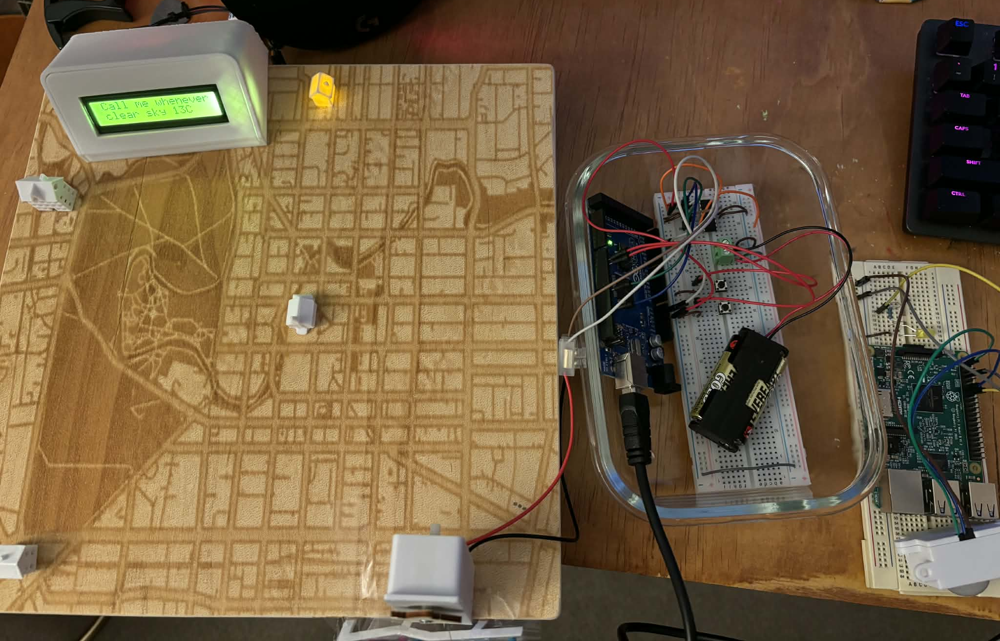
*Final assembled system*

---

## System Requirements and Architecture

The system combines:
- **Internet-based communication** (MQTT, cloud broker)
- **Wireless and physical inputs**
- **Digital and analogue outputs**
- **A mechanically actuated component**

Geofencing and PIR-triggered events are transmitted via MQTT to HiveMQ. Node-RED processes the data and updates LEDs, LCD messages, and motor behaviour accordingly.

---

## Inputs

| Input             | Type     | Description            |
| ----------------- | -------- | ---------------------- |
| PIR motion sensor | Digital  | Detects motion at home |
| Push buttons      | Digital  | Manual motor control   |
| Geofence events   | Digital  | Location triggers      |
| Weather API       | Analogue | Environmental data     |

## Outputs

| Output        | Type    | Description         |
| ------------- | ------- | ------------------- |
| LEDs          | Digital | Location indicators |
| LCD1602 (I²C) | Digital | Status and weather  |
| TT DC motor   | PWM     | LEGO climber motion |

---

## Bill of Materials

### Microcontrollers & Computing
- 2 × Raspberry Pi (Model 3 and Model 4)
  - Node-RED, MQTT handling, LEDs, LCD, PIR
  - *Note:* One Pi could be replaced with a Wemos D1 Mini for a lower-cost build
- Arduino Mega
  - Controls motor driver and button inputs
  - *Note:* This could also be replaced with a Wemos D1 Mini
- Raspberry Pi GPIO HAT (solderable)
- 2 × Micro SD cards

### Power Components
- USB battery pack (Raspberry Pi 4)
- USB wall adapter (Raspberry Pi 3)
- 2 × AA batteries (motor prototypes)

### Electronics & Wiring
- 4 × LEDs
- 4 × 220ohm –330ohm resistors
- Female pin headers
- Jumper wires (F–F, M–M, F–M)
- Breadboards (minimum 2)

### Sensors & Displays
- PIR motion sensor
- LCD1602 I²C display

### Mechanical Components
- TT DC motor
- L293D motor driver IC
- Fishing line
- LEGO minifigure
- Wooden or printed rope guide

### Optional (Presentation)
- 3D-printed LCD and PIR enclosures
- 3D-printed location icons
- 30 × 30 cm plywood base
- Wood glue

---

## Powering the System

The system is designed for continuous operation.

- Raspberry Pi 3 (PIR): USB wall adapter
- Raspberry Pi 4 (LEDs + LCD): USB power bank
- Arduino Mega (motor): USB wall adapter

This avoids disposable batteries and improves reliability.

---

## Physical Map Base Construction

Create a **30 × 30 cm plywood base** to act as the physical map surface. This board represents the Monopoly-style Christchurch map and houses the LEDs and wiring.

### Step 1 – Prepare the Map Surface
- Cut a square plywood panel measuring **30 × 30 cm**.
- Engrave or laser-etch a **street-level map of Christchurch** onto the top surface.
- Clearly mark the three key locations (e.g. home, university, work).

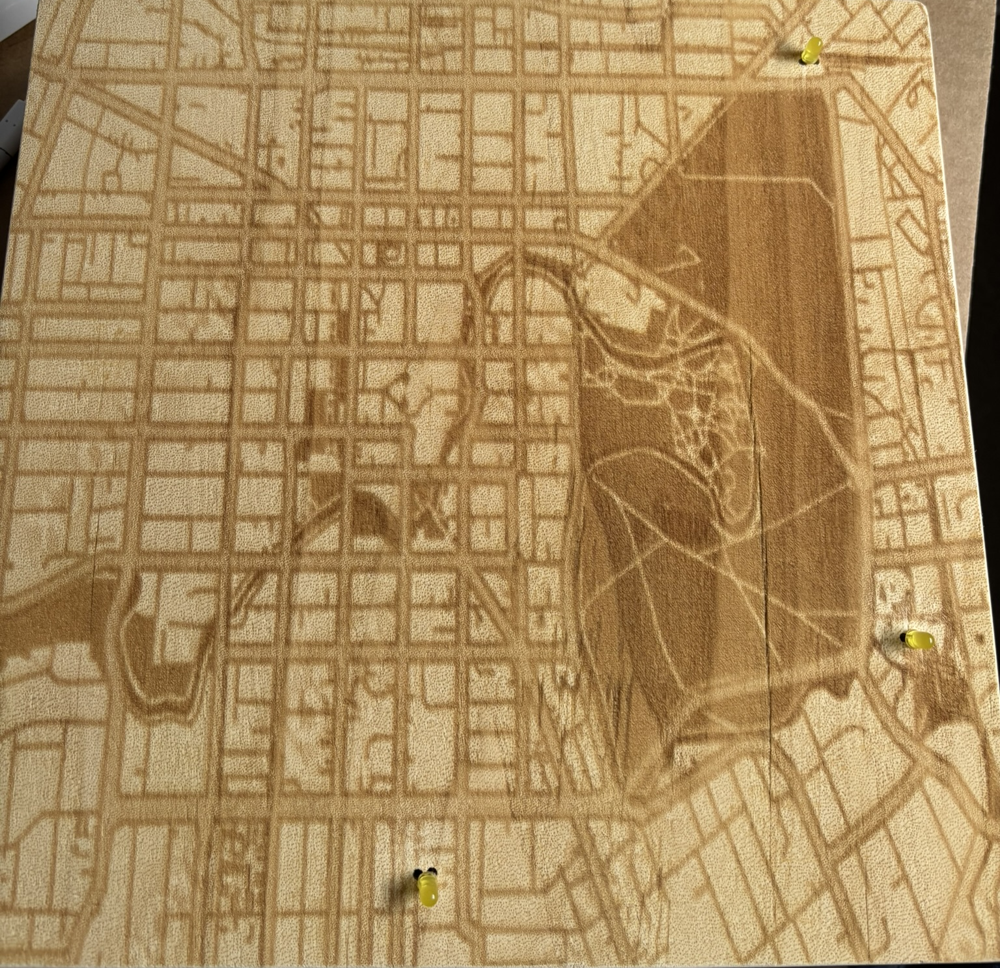
*Laser-engraved map surface*

### Step 2 – Drill LED Mounting Holes
- For **each location**, drill **two small holes** close together.
- The holes should be spaced just wide enough for **both LED legs to pass through**.
- Ensure the holes are clean and smooth to avoid damaging LED leads during installation.

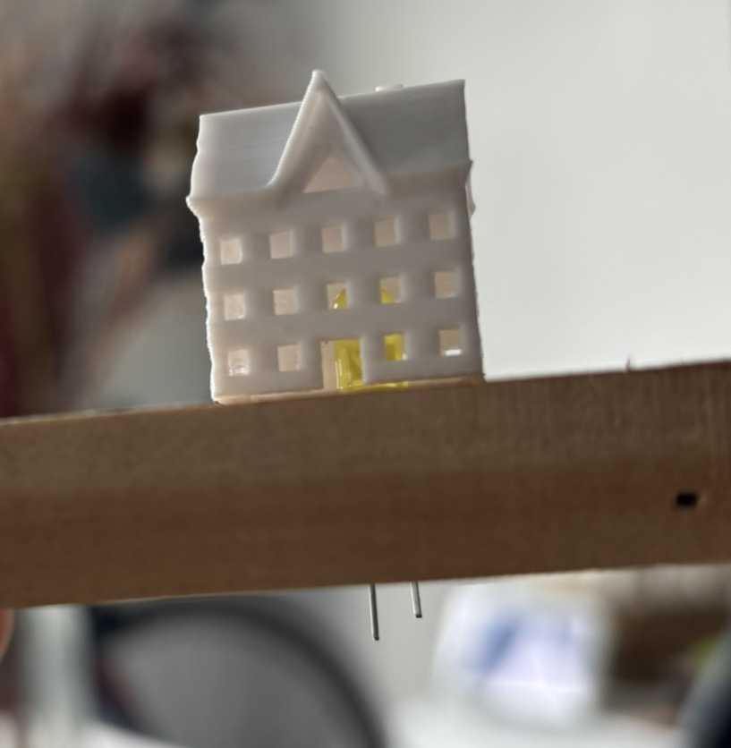
*LED mounting hole layout*

### Step 3 – Elevate the Board for Electronics
- The board must be raised to provide space underneath for wiring and soldered connections.
- Construct a **support frame approximately 8 cm high** using wooden strips.
- Attach the frame to the underside edges of the board using **wood glue**.
- Clamp the frame firmly while the glue cures to keep the structure square and level.

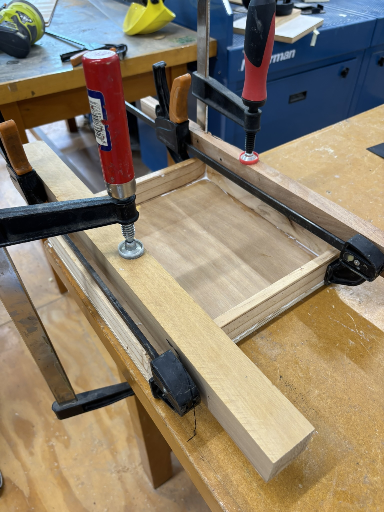
*Elevated base construction*

---

## Build and Configuration Guide

### Raspberry Pi and LED Prototype Setup

1. Create a **serverless HiveMQ Cloud cluster**
2. With the Pi **unplugged**, prototype LEDs on a breadboard:
   - Anode (long leg) → resistor → 3.3V
   - Cathode (short leg) → ground
   - All LEDs share a common ground
3. Flash Raspberry Pi OS with Node-RED enabled  
   - See `raspberry_pi_image.md` in the repository
   - Youtube videos are also quite useful for demonstrating step by step processes for how to do this
4. Power the Pi
5. Verify LED operation

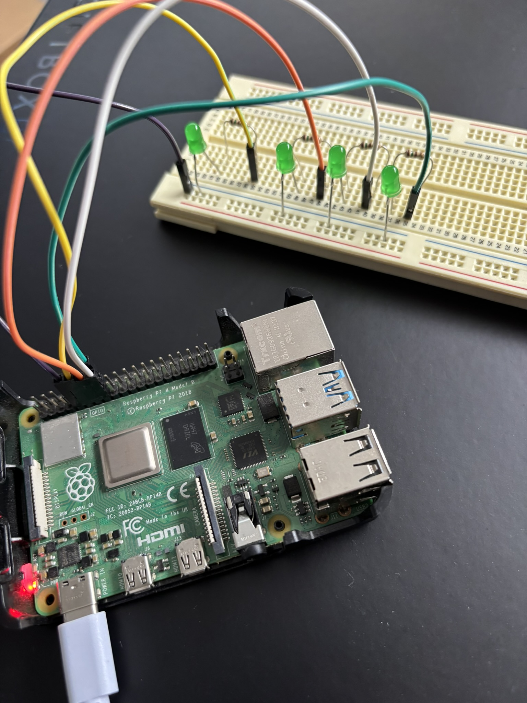
*LED breadboard prototype*

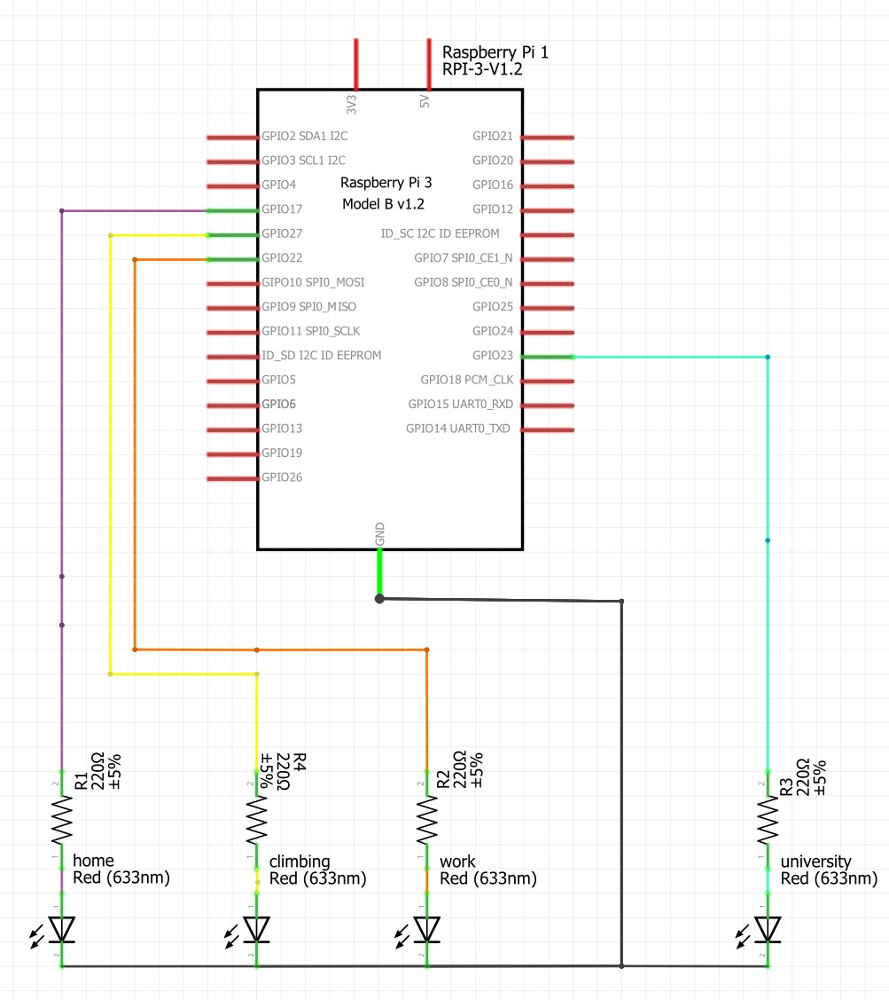
*LED wiring schematic*

For the final setup, you will want to solder the LEDs onto female headers that will go on the Raspberry PI. The LEDs will be placed through the plywood board first, and then its legs are soldered underneath. We want to translate the breadboard to something we can nicely fit on our final map.

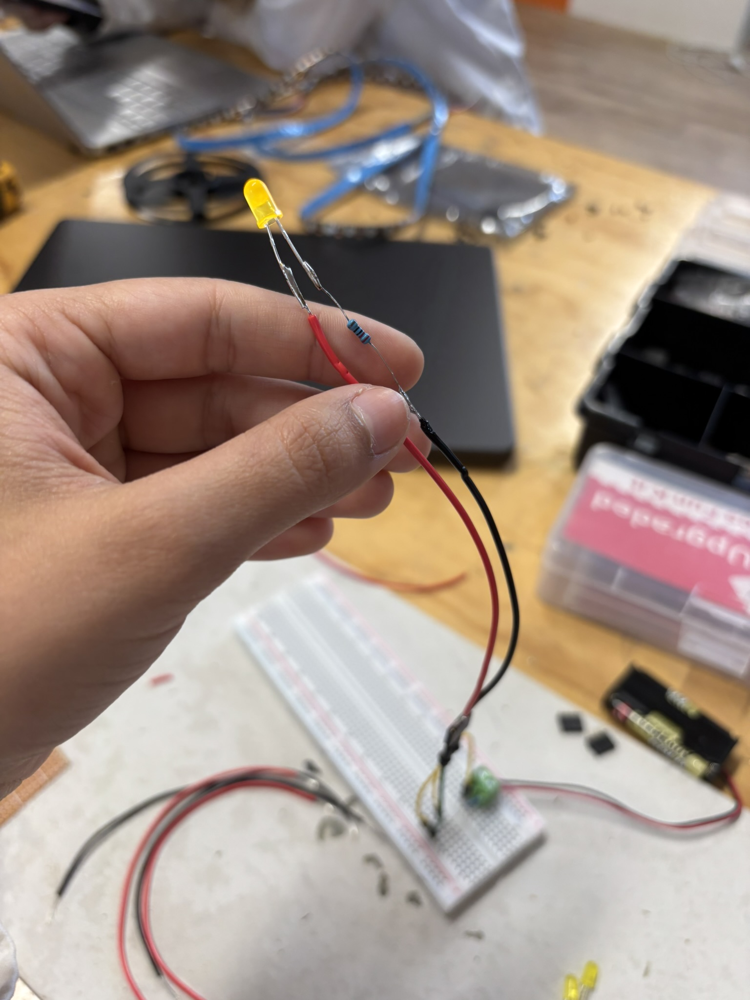
*LED soldering*

---

### Node-RED Location Processing

Create a new MQTT broker configuration:
- Broker: HiveMQ Cloud URL
- Port: 8883
- Enable TLS
- Enter username and password

#### Flow 1 – Location LEDs
1. Subscribe to `python/mqtt`
2. Parse location payloads (`work`, `university`)
3. Map each location to a GPIO output
4. Activate the LED for the location once a message is received
5. Override other LEDs by sending 0 (OFF/LOW) signal to ensure only one LED is ON at a time

#### Flow 2 – Home Presence
1. Subscribe to `home/presence`
2. Activate home LED once a message is received
3. Override other LEDs by sending 0 (OFF/LOW) signal to ensure only one LED is ON at a time
4. Publish message 'OK' to `home/presence/ack` to act as a health check

--- 

### LCD and Weather Integration

- Install `node-red-contrib-i2clcd`
- LCD layout:
  - **Line 1:** Availability message
  - **Line 2:** Weather + temperature

- Use an HTTP Request node to call OpenWeather API
  - ```
    https://api.openweathermap.org/data/2.5/weather?q=
    YOUR_CITY,YOUR_COUNTRY&units=metric&appid=YOUR_API_KEY
    ```
- With each LED logic, connect an LCD node in the series and use the below code to format the data from the API, as well as your custom message
- The LCD wiring is simple, check the datasheet for instructions for your model and directly connect them to the Raspberry PI using jumper cables
- For ease of wiring the jumper cables to the outside of the board I made a hole on the side of the map that I wanted the LCD to sit on
- Pass the cables through and cable tie them for neatness (also helps them not disconnect)


#### LCD Function Code

```js
    let temp = Math.round(msg.payload.main.temp);
    let desc = msg.payload.weather[0].description;

    // Build LCD payload
    msg.payload = [
        {
            clear: true,
            text: "Call me whenever!",
            alignment: "left"
        },
        {
            text: `${desc} ${temp}C`.substring(0, 16),
            alignment: "left"
        }
    ];

    return msg;
```

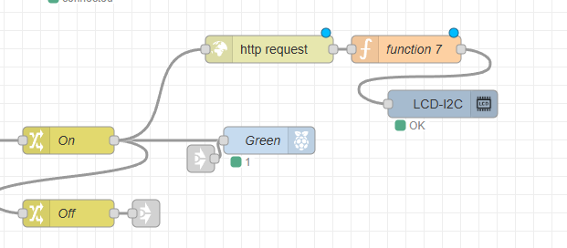
*Example Node-RED flow*

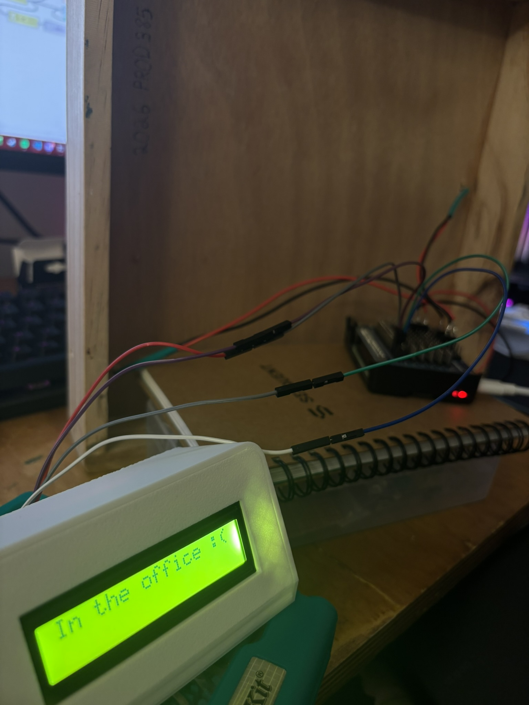
*LCD mounted and wired*

---

### PIR Sensor Integration

With your second Pi:

#### Wiring

- VCC → 5V
- GND → Ground
- OUT → GPIO input

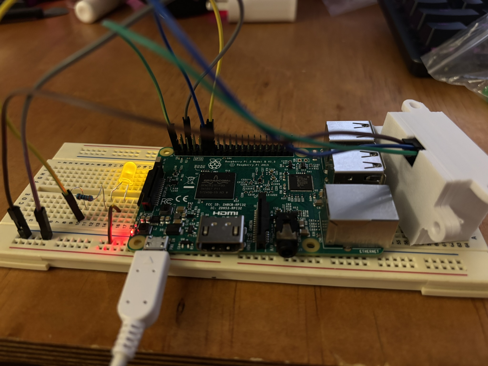
*PIR sensor setup*

#### Node-RED Logic

- GPIO input node
- Rising-edge motion detection
- Publish MQTT message:
    ```
    home/presence: home
    ```
- Subscribe to `home/presence/ack`
- Wire a simple LED circuit that lights up once the Pi has received acknowledgement that motion sensor triggered the LED of the IoT map
  
---

## Mechanical Climbing Rope Mechanism

This subsystem adds a physical, kinetic element to the project by simulating a climbing action using a **TT DC motor**, fishing line, and a LEGO minifigure. The mechanism converts rotational motor motion into controlled vertical movement.

### System Overview
- A **TT DC motor** is mounted above the climbing area and acts as a winch
- A **custom wooden spool** is attached to the motor shaft
- **Fishing line** is wound around the spool and attached to a LEGO climber
- As the motor rotates, the rope winds or unwinds, moving the climber up or down

---

#### Step 1 – Motor and Spool Assembly
- Attach a **small wooden spool or cross-shaped pulley** to the shaft of the TT DC motor
- Secure the spool using:
  - A central screw, or
  - Press-fit and glue, ensuring it does not slip under load
- The spool diameter should be small to limit vertical travel per rotation and prevent excessive movement

---

#### Step 2 – Rope Setup
- Use **fishing line** or a similar thin, strong cord
- Tie one end securely to the spool
- Wind several turns of line around the spool in a single direction
- Attach the free end of the line to the LEGO minifigure:
  - The knot should be tight but positioned so the climber hangs upright
  - Keep the line as vertical as possible to avoid sideways drift

---

#### Step 3 – Climbing Surface
- Mount a **perforated or textured vertical panel** behind the climber
- This provides:
  - Visual realism (climbing wall effect)
  - A reference surface to judge movement distance
- The panel does not bear load; it is purely structural and visual, it can be glued, or - depending on its structure - placed gently on the edge of the board

---

#### Step 4 – Control and Safety Considerations
- The motor is driven via an **L293D motor driver**, allowing:
  - Direction control (up/down) - bidirectional
  - Speed control using PWM
- The climber is lightweight, though **not weightless**, ensuring:
  - Low torque requirements
  - Reduced strain on the motor and driver

---

#### Step 5 – Upload Code to the Arduino
- Using Arduino IDE, upload the sketch found under the sketches folder in the root of this repository `./arduino_sketches/climbing_arduino.ino`

---

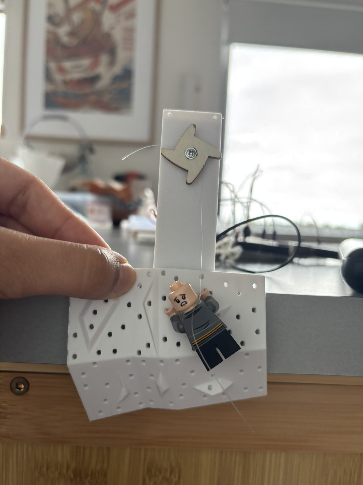
*Mechanical climbing mechanism - testing phase*

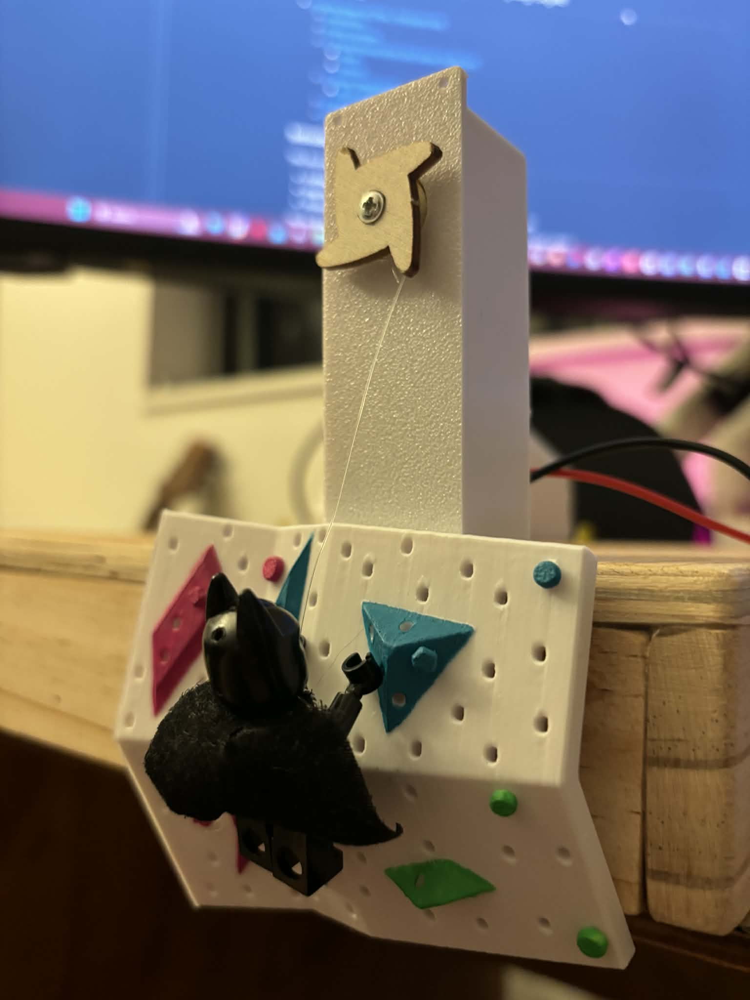
*Climber in motion - final*

---

## Testing Scripts

These scripts will send the location MQTT message to HiveMQ for easy and quick testing. Ensure you have read the comments that explain where to put your credentials, as well as uncommenting your chosen topic for the manual test script.

- `presentation_test_workflow.py`
  - Automatically cycles through locations (used during demo)
- `manual_test_workflow.py`
  - Manually trigger locations by editing topic selection

## FAQ and Debugging Tips

**What direction do electrons flow?**
- Electrons flow from negative (cathode) to positive (anode)
- This is a very useful simple concept to remember
- It is vital to remember this when building larger circuits. Basics are as important if not more than complex concepts!

---

**Why is my LED wired correctly but still not turning on?**
- Ensure the LED has a **current-limiting resistor** (typically 220–330Ω)
- Double-check **polarity** (long leg = anode, short leg = cathode)
- Confirm the GPIO pin is configured as an **output**
- Verify that the LED is not exceeding the **GPIO current limit**
- Always ensure a **common ground** between all connected components

---

**Can I power motors or servos directly from a Raspberry Pi or Arduino GPIO pin?**
- No. GPIO pins **cannot supply enough current**
- Motors and servos must be powered from:
  - An **external power supply**, or
  - A **motor driver / servo driver**
- GPIO pins should only provide **control signals**, never power

---

**Why is my I2C LCD not lighting up or displaying anything?**
- Check wiring carefully:
  - **SDA → SDA**
  - **SCL → SCL**
  - **VCC → correct voltage (often 5V)**
  - **GND → common ground**
- Adjust the **contrast potentiometer** on the LCD module
- Confirm the I2C address using an `i2cdetect` scan
- If using 5V LCD with a Raspberry Pi:
  - Ensure **logic-level compatibility** (level shifter if required)

---

**Do I need a common ground when using multiple power sources?**
- **Yes - always**
- All components (Pi, Arduino, motor driver, sensors) must share a **common ground**
- Without this, control signals will behave unpredictably or not work at all

---

**Why isn’t my PIR sensor triggering messages?**
- Allow **30–60 seconds warm-up time** after power-up
- Ensure the PIR output is connected to a **GPIO input pin**
- In Node-RED:
  - Use a **GPIO input node**
  - Detect **rising edge** events
- Verify the sensor is powered with the correct voltage (usually 5V, but some are compatible with 3.3V)

---

**Why does my servo or motor jitter or behave erratically?**
- Power supply may be insufficient or unstable
- PWM values may be changing too quickly
- Ensure:
  - External power for motors
  - Shared ground
  - Smooth PWM ramping for slow movement

---

**Why isn’t my Node-RED flow responding to MQTT messages?**
- Verify the **exact topic name** (MQTT is case-sensitive)
- Confirm the payload format matches what your flow expects
- Use an MQTT debug node to inspect incoming messages
- Test with manual publish tools before integrating hardware

---

**Why does my LCD text overflow or look cut off?**
- LCD1602 screens support **16 characters per line**
- Truncate or substring text before sending
- Avoid automatic line wrapping — format explicitly
- Update only when content changes to prevent flicker

---

**Why do I need a motor driver (e.g., L293D) instead of wiring the motor directly?**
- Motor drivers:
  - Protect your microcontroller
  - Handle higher currents
  - Allow **bi-directional control**
  - Enable **PWM speed control**
- Direct motor wiring can permanently damage GPIO pins

---

**What’s the safest way to test my system before full deployment?**
- Test subsystems independently:
  - MQTT → LEDs
  - PIR → MQTT
  - Buttons → Motor
- Use **manual MQTT publishes** for validation
- Start with **low PWM values**
- Secure all cables before final testing

---

**What are the most common mistakes beginners make in this project?**
- Forgetting current-limiting resistors
- Powering motors/servos from GPIO
- Not sharing a common ground
- Incorrect I2C wiring or address
- MQTT topic or payload mismatches
- Missing credentials on MQTT connection

---

**If something suddenly stops working, what should I check first?**
- Loose jumper wires (very common)
- Power connections
- MQTT broker connectivity
- Internet connectivity
- Restart Node-RED and the device
- Take a breath — it’s usually something small
